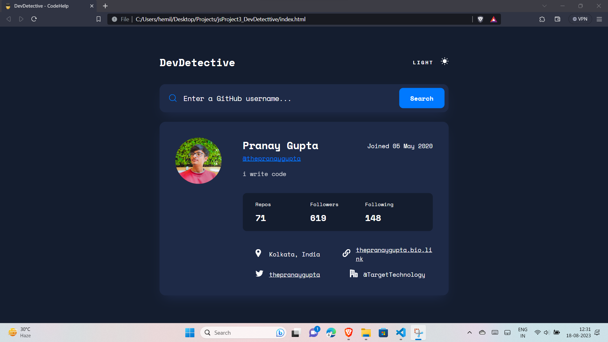

# DevDetective App README

## Table of Contents

- [Introduction](#introduction)
- [Features](#features)
- [Getting Started](#getting-started)
  - [Prerequisites](#prerequisites)
  - [Installation](#installation)
- [Usage](#usage)
- [Contributing](#contributing)

## Introduction

Welcome to DevDetective, a web application designed to help you discover details about developers using their GitHub IDs. This app is built using JavaScript, CSS, and HTML, and it provides an intuitive interface to retrieve and display valuable information about developers' GitHub profiles.

## Features

- **GitHub Details**: Enter a GitHub ID and get access to a wide range of information about the developer, including profile details, repositories, followers, following, and more.

- **User-Friendly Interface**: The app boasts a simple and user-friendly interface, making it easy for anyone to use, regardless of their technical expertise.

- **Responsive Design**: DevDetective is designed to work seamlessly across various devices and screen sizes, ensuring a consistent experience for all users.

- **Quick Results**: Receive quick and accurate results, enabling you to gather essential developer information efficiently.

## Getting Started

### Prerequisites

Before you begin, ensure you have the following:

- A modern web browser (e.g., Chrome, Firefox, Safari)
- Internet connection

### Installation

1. Clone this repository to your local machine or download the ZIP file and extract it.
2. Navigate to the project directory in your terminal.

## Usage

1. Open the `index.html` file in your preferred web browser.
2. You will be greeted with a simple and intuitive interface.
3. Enter the GitHub ID of the developer you want to learn more about.
4. Click the "Search" button.
5. DevDetective will fetch and display various details about the developer's GitHub profile.

## Contributing

Contributions are welcome and encouraged! Here's how you can contribute to DevDetective:

1. Fork the repository.
2. Create a new branch for your feature or bug fix.
3. Make your changes and enhancements.
4. Test thoroughly.
5. Commit your changes with descriptive commit messages.
6. Push your changes to your forked repository.
7. Create a pull request, detailing your changes and improvements.

Thank you for using DevDetective! We hope this app enhances your experience in exploring and connecting with developers on GitHub. If you have any questions, issues, or suggestions, please feel free to reach out to us. Happy coding!